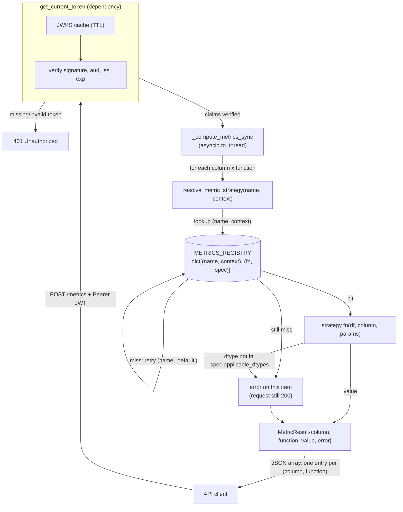

# Architecture

## Strategy Pattern, not Factory

Both `functions` and `metrics` are dispatched through a **Strategy Pattern**
registry: a plain `dict` lookup against callables that were registered ahead
of time via decorators. There's no class hierarchy, no abstract base class,
and no object construction at request time — which is precisely why this is
Strategy and not Factory. A Factory *builds* an object based on some input;
here, every strategy already exists as a module-level function the moment
the app starts, and resolving one is just `dict[key]`.

- `functions` registry: keyed by `name` alone — one dimension.
- `metrics` registry: keyed by `(name, context)` — two dimensions, because
  the same metric name can mean a different formula depending on domain
  (see [Functions vs Metrics](functions-vs-metrics.md)).

Adding a new function or metric means adding a new decorated callable in
`app/functions/` or `app/metrics/` — routing, validation, and the request
lifecycle never change.

## Request flow



Three things this diagram is making explicit:

1. **Auth is a hard gate before any computation** — the JWKS cache/verify
   step either rejects the request outright or hands off verified claims;
   `_compute_metrics_sync` never runs otherwise.
2. **The registry lookup has a built-in retry**, not a hard failure: an
   unregistered `(name, context)` pair automatically retries `(name,
   "default")` before giving up. See [Context Resolution](context-resolution.md).
3. **Failure is per-item, not per-request.** A dtype mismatch or unknown
   metric name on one `(column, function)` pair produces an `error` in that
   result entry — the rest of the batch still computes, and the HTTP status
   stays `200`.

The `functions` flow is the same shape, minus the context dimension:
`resolve_function_strategy(name)` is a 1D lookup, and an unresolvable name
is a `404` at the route level instead of a per-item error (see
[Functions vs Metrics](functions-vs-metrics.md) for why that distinction
exists).

## Why stateless

No upload, no persistence, no `dataset_id`. Data travels inline in the
request body (`pl.DataFrame(req.data, infer_schema_length=None)`) and the
response is computed and returned in the same call. This keeps the service
trivially horizontally scalable (any instance can serve any request) and
sidesteps a whole class of problems — data retention, cleanup, access
control per dataset — that a stateful version would have to solve.

## Concurrency model

Endpoints are `async def`; the actual Polars computation is synchronous and
CPU-bound, so it's offloaded via `asyncio.to_thread` rather than run inline
on the event loop:

```python
@app.post("/metrics", response_model=list[MetricResult])
async def compute_metrics(req: MetricsRequest) -> list[MetricResult]:
    return await asyncio.to_thread(_compute_metrics_sync, req)
```

This keeps the event loop free to serve other requests (including JWKS
fetches on cache-miss) while a heavy computation runs. A custom
`anyio.CapacityLimiter` to bound concurrent thread usage is a deliberate
next iteration, not implemented yet — see the changelog.
